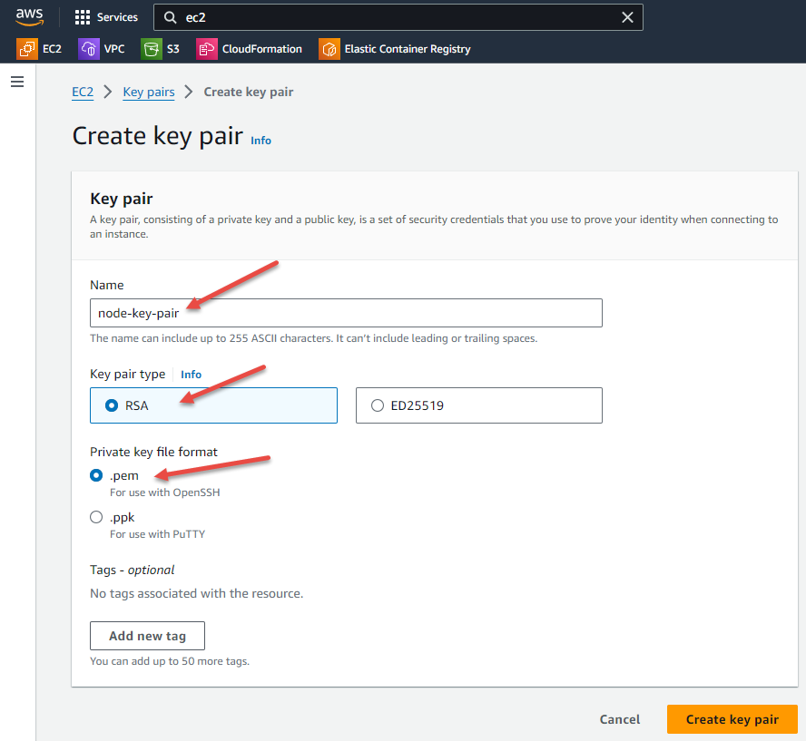
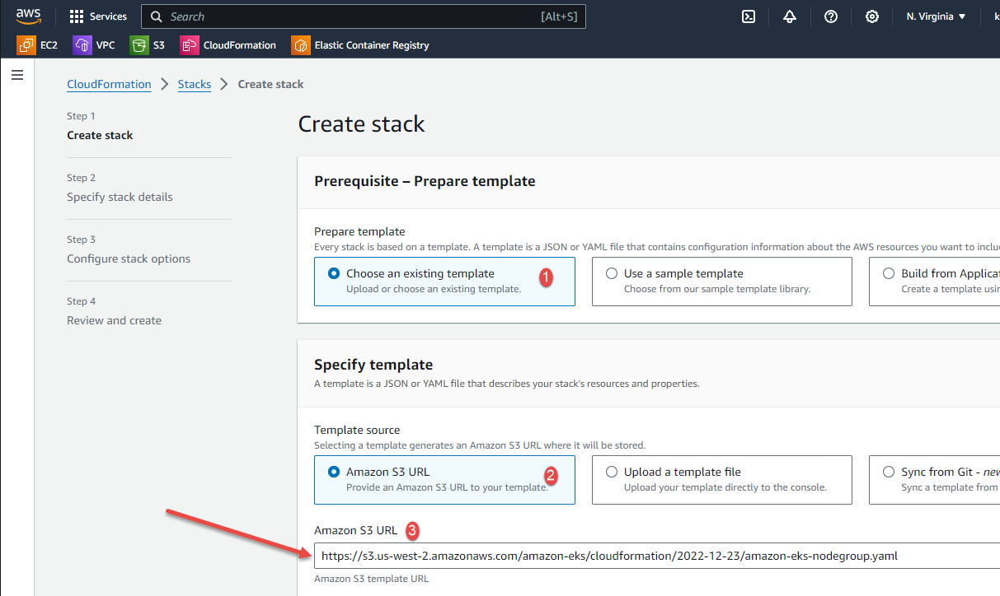
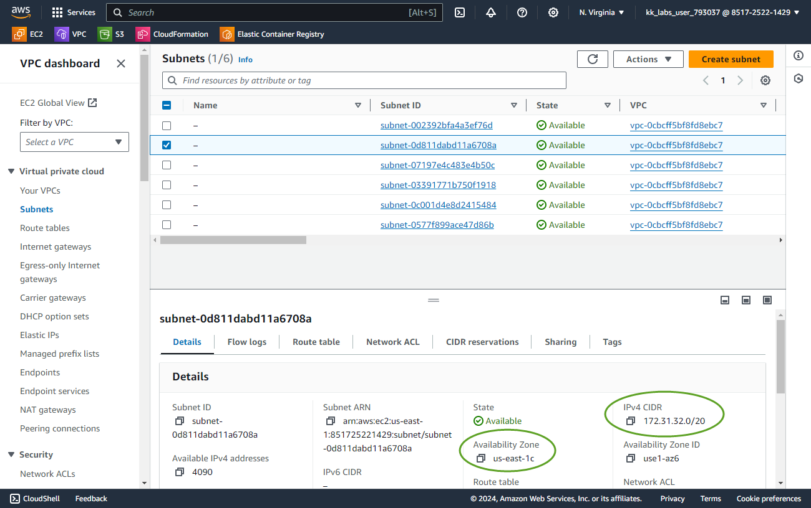
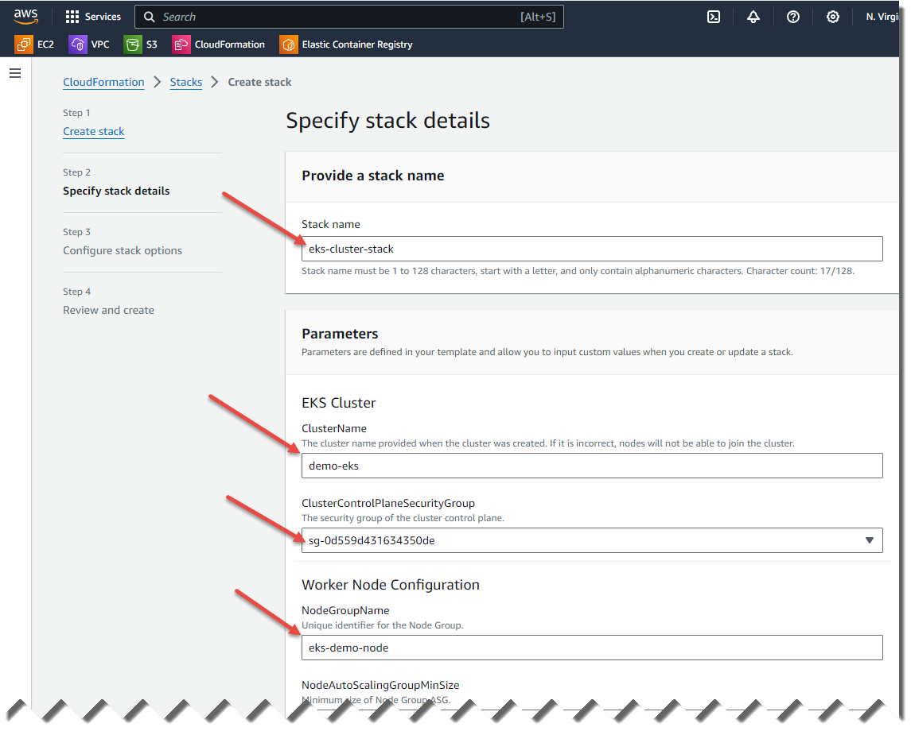
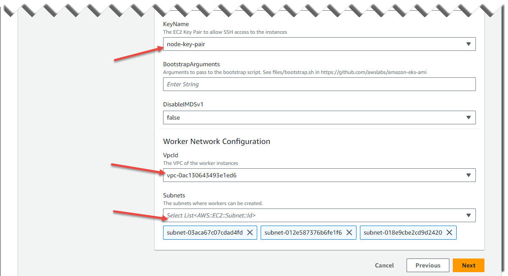
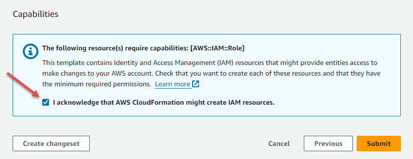
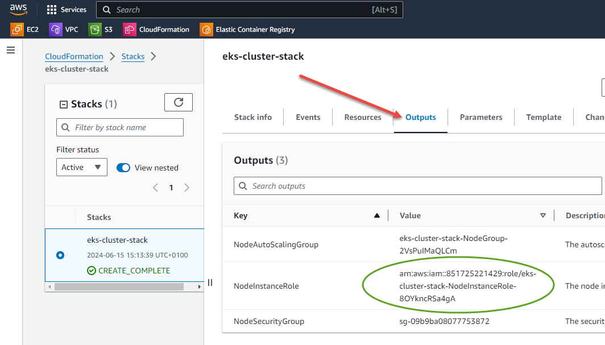

# Add Cluster Nodes

Now we will add some *unmanaged* nodes to the cluster. AWS Playground does not support managed node groups.

1. Create an SSH keypair for the nodes to use
    1. Navigate to the EC2 console by typing `ec2` in the search box at the top, and then selecting it from the list.
    1. Scroll down the menu on the left until you see `Key Pairs`, then click that to enter the key piars console.
    1. Click the orange `Create key pair` button at the top right
    1. Fill out the form using `node-key-pair` as name, `RSA` as key pair type and `.pem` as private key format

        

    1. Press the `Create key pair` button

1. Navigate to the CloudFormation console, again using the search box. CloudFormation is AWS's native Infrastructure as Code, and we will use a pre-prepared template to define worker nodes.
    1. Press the orange `Create stack` button
    1. Select Choose an existing template from Amazon S3 URL and use the following URL: `https://s3.us-west-2.amazonaws.com/amazon-eks/cloudformation/2022-12-23/amazon-eks-nodegroup.yaml`

        

    1. Scroll to end of page and press `Next`

1. Now we fill in the parameters required to deploy the nodes
    1. `Stack Name`: `eks-cluster-stack`
    1. `ClusterName`: `demo-eks`
    1. `ClusterControlPlaneSecurityGroup`: Click in the box and select the one with a name that contains `eks-cluster-sg`
    1. `NodeGroupName`: `eks-demo-node`
    1. `KeyName`: (you will likely need to scroll down to find this) - `node-key-pair` as created above.
    1. `VpcId`: Click in the box and select the only entry that is there
    1. `Subnets`. Sadly the drop-list does not show the AZ of the nets so it is fiddly to determine which ones to select
        1. Open the [subnets console](https://us-east-1.console.aws.amazon.com/vpcconsole/home?region=us-east-1#subnets:) in another browser tab or window.
        1. Click on each subnet to view its information in the lower pane.
        1. Note the IPv4 CIDR for the ones that are in `us-east-1a`, `us-east-1b` annd `us-east-1c`

            

        1. Choose these subnets back in the cloudformation console

            

    1. Leave other settings as defaults

    It should now look something like this

    

    

1. Press `Next`
1. Nothing to do on the following screen. Scroll to end and press `Next`
1. Now you are on the final screen. Scroll to the end and check the acknowledge box, then press `Submit`

    

1. Wait for stack creation to complete which will take a few minutes. You may need to press the Refresh button a few times until it gets to `CREATE COMPLETE`

    

1. Now select the `Outputs` tab and note down the value of `NodeInstanceRole`. You need this when you join your Amazon EKS nodes.

    

Prev: [Create Cluster](./05-create-cluster.md) 
Next: [Join Worker Nodes](./07-join-nodes.md)

